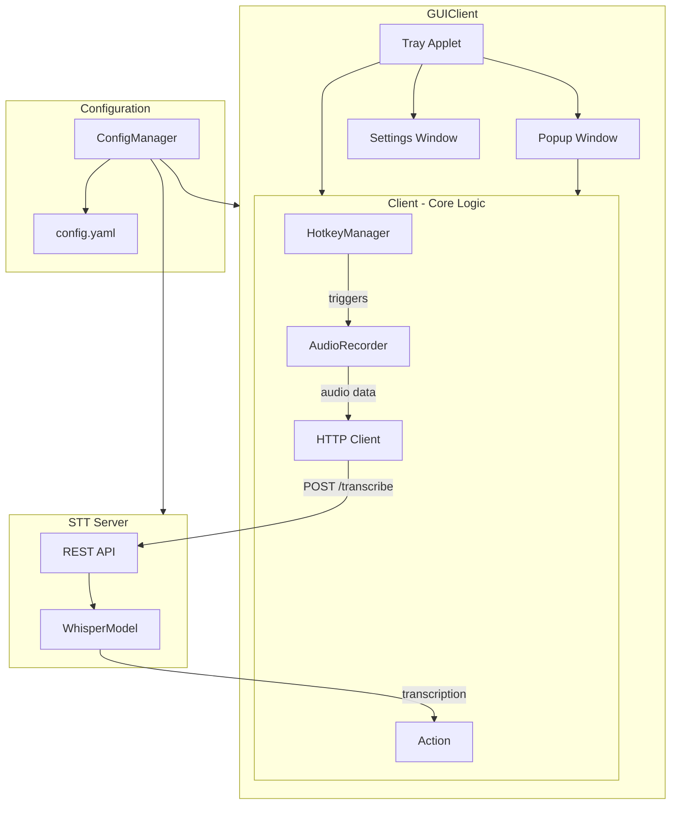

# EchoType

**EchoType** — a client-server application for Speech-to-Text based on faster-whisper and inspired by AquaVoice.

## Features

- 🎤 **Voice recording via hotkeys** — Push-to-Talk and Toggle modes
- 🚀 **Fast recognition** — based on faster-whisper with GPU (CUDA) support
- 📋 **Text insertion** — automatic typing into active application or clipboard copy
- 🖼️ **GUI interface** — system tray applet, popup window with audio visualization, settings window
- ⚙️ **Flexible configuration** — YAML-based configuration

## Architecture



### Components

| Component | File | Description |
|-----------|------|-------------|
| [`STTServer`](STTServer/stt_server.py) | STTServer/stt_server.py | FastAPI server with Whisper model |
| [`GUIClient`](GUIClient/gui_client.py) | GUIClient/gui_client.py | PyQt6-based GUI client, uses Client internally |
| [`Client`](Client/client.py) | Client/client.py | Core client logic, coordinates HotkeyManager, AudioRecorder and server communication |
| [`HotkeyManager`](Client/HotkeyManager/hotkey_manager.py) | Client/HotkeyManager/ | Hotkey management with PTT and Toggle modes |
| [`AudioRecorder`](Client/AudioRecorder/audio_recorder.py) | Client/AudioRecorder/ | Audio recording from microphone |
| [`ConfigManager`](config_manager.py) | config_manager.py | Singleton configuration manager |

## Project Structure

```
EchoType/
├── main.py                    # Server entry point
├── gui_client.py              # GUI client entry point
├── cli_client.py              # CLI client entry point
├── config.yaml                # Configuration file
├── config_manager.py          # Configuration manager
│
├── STTServer/                 # Speech-to-Text server
│   ├── __init__.py
│   └── stt_server.py
│
├── Client/                    # Client core
│   ├── __init__.py
│   ├── client.py
│   ├── AudioRecorder/         # Audio recording module
│   │   ├── audio_recorder.py
│   │   ├── audio_data.py
│   │   └── recording_state.py
│   └── HotkeyManager/         # Hotkey module
│       ├── hotkey_manager.py
│       ├── hotkey_action.py
│       ├── hotkey_mode.py
│       └── hotkey_state.py
│
├── GUIClient/                 # GUI components
│   ├── gui_client.py
│   ├── TrayApp/               # System tray applet
│   ├── Windows/               # Windows (popup, settings)
│   ├── Widgets/               # Widgets (visualizer, timer)
│   ├── Style/                 # QSS styles
│   └── SFX/                   # Sound effects
│
└── plans/                     # Documentation and plans
```

## Tech Stack

| Category | Technology |
|----------|------------|
| Server | FastAPI, uvicorn |
| STT | faster-whisper |
| GUI | PyQt6 |
| Audio | sounddevice, soundfile |
| Hotkeys | pynput |
| Configuration | PyYAML |

## Quick Start

### Installation

```bash
# Clone the repository
git clone https://github.com/Protectore/EchoType.git
cd EchoType

# Install dependencies (requires uv)
uv sync
```

### Running

```bash
# Start the server
uv run python main.py

# Start the GUI client (in another terminal)
uv run python gui_client.py
```

### Configuration

Main settings in [`config.yaml`](config.yaml):

```yaml
# Whisper model
model:
  size: medium        # tiny, base, small, medium, large-v3
  device: cuda        # cuda or cpu
  compute_type: float16

# Hotkeys
hotkeys:
  record:
    keys: alt_gr      # Recording key
    mode: ptt         # ptt (Push-to-Talk) or toggle

# GUI
gui:
  show_popup: true
```

## Recording Modes

### Push-to-Talk (PTT)
Hold the key to record. Release to stop recording and send for recognition.

### Toggle
Press the key to start recording. Press again to stop.

## Requirements

- Python 3.13+
- CUDA (optional, for GPU acceleration)

## License

MIT

## Support

You can support project/developer on [DonationAlerts](https://www.donationalerts.com/r/protectoreh). Thank you!

