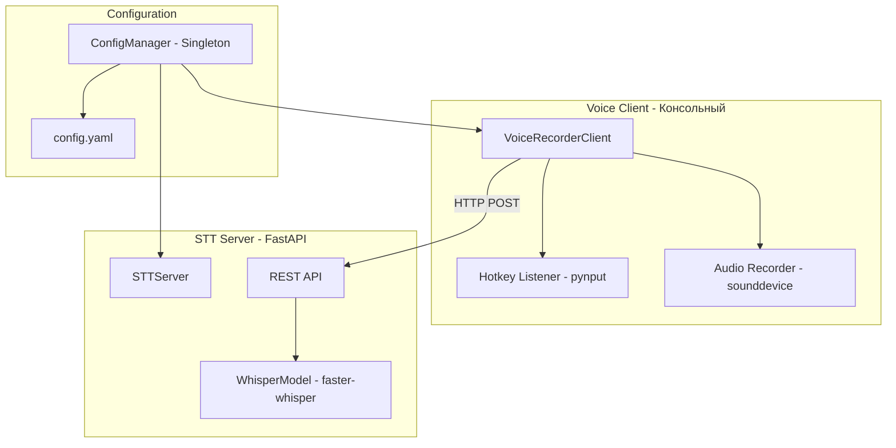
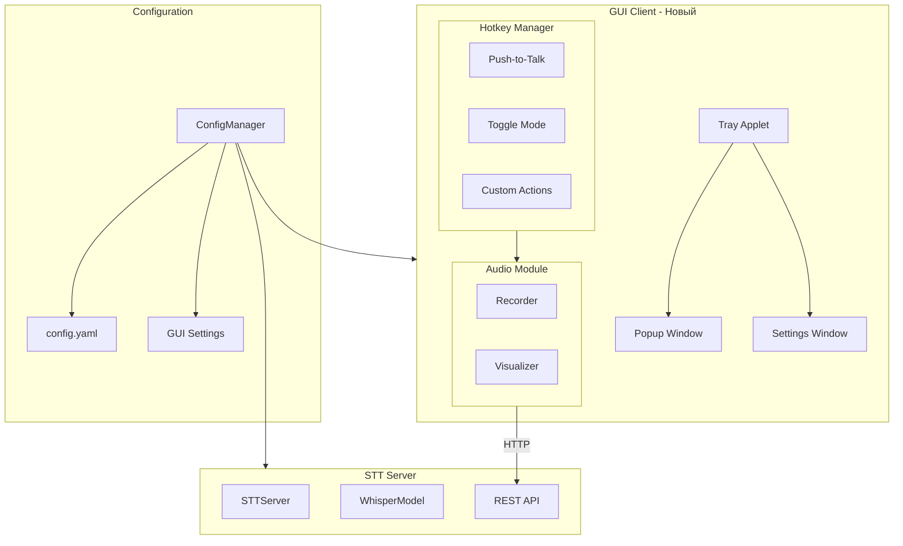
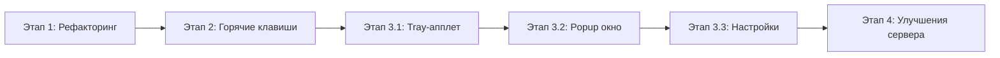

# EchoType: Архитектура и План Развития

## Обзор проекта

**EchoType** — клиент-серверное приложение для распознавания речи (Speech-to-Text) на основе faster-whisper. Позволяет записывать голос через горячие клавиши и получать текст.

---

## Текущая архитектура



### Компоненты

| Компонент | Файл | Назначение |
|-----------|------|------------|
| [`STTServer`](STTServer/stt_server.py) | STTServer/stt_server.py | FastAPI сервер с Whisper моделью |
| [`VoiceRecorderClient`](VoiceClient/voice_client.py) | VoiceClient/voice_client.py | Консольный клиент записи голоса |
| [`ConfigManager`](config_manager.py) | config_manager.py | Singleton менеджер конфигурации |

### Текущие возможности

- ✅ Запись голоса по горячей клавише (AltGr)
- ✅ Toggle режим записи (начать/остановить)
- ✅ Отправка аудио на сервер для распознавания
- ✅ Вставка текста в активное приложение или буфер обмена
- ✅ Настраиваемая модель Whisper (tiny...large-v3)
- ✅ Поддержка GPU (CUDA) и CPU

---

## Целевая архитектура



---

## План развития

### Этап 1: Архитектурные изменения

#### 1.1 Рефакторинг клиента
- [ ] Выделить [`AudioRecorder`](VoiceClient/voice_client.py) в отдельный класс
- [ ] Создать [`HotkeyManager`](VoiceClient/voice_client.py) для управления горячими клавишами
- [ ] Разделить логику записи и UI

#### 1.2 Расширение конфигурации
- [ ] Добавить секцию `hotkeys` в [`config.yaml`](config.yaml)
- [ ] Добавить секцию `gui` для настроек интерфейса
- [ ] Добавить методы в [`ConfigManager`](config_manager.py)

### Этап 2: Система горячих клавиш

#### 2.1 Push-to-Talk режим
- [ ] Реализовать режим записи при удержании клавиши
- [ ] Добавить визуальный индикатор записи

#### 2.2 Настраиваемые горячие клавиши
- [ ] Создать систему регистрации горячих клавиш
- [ ] Поддержка комбинированных клавиш (Ctrl+Shift+A)
- [ ] Конфликт-детекция между горячими клавишами

#### 2.3 Режимы записи
- [ ] Обычная запись → вставка текста
- [ ] Запись с копированием в буфер
- [ ] Запись с нажатием Enter в конце
- [ ] Запись с добавлением в конец существующего текста

### Этап 3: GUI клиент

#### 3.1 Tray-апплет
- [ ] Иконка в системном трее
- [ ] Контекстное меню: Запись, Настройки, Выход
- [ ] Индикация статуса (готов/запись/ошибка)
- [ ] Выбор библиотеки: `pystray` или `Qt`

#### 3.2 Всплывающее окно при записи
- [ ] Минималистичное окно с визуализацией аудио
- [ ] Таймер записи
- [ ] Превью распознанного текста
- [ ] Кнопки действий: копировать, повторить, закрыть

#### 3.3 Окно настроек
- [ ] Выбор горячих клавиш
- [ ] Настройки аудио (устройство, sample rate)
- [ ] Выбор режима вывода
- [ ] Подключение к серверу

### Этап 4: Улучшения сервера

#### 4.1 WebSocket поддержка
- [ ] Добавить WebSocket endpoint для streaming
- [ ] Реал-тайм транскрипция

#### 4.2 Оптимизации
- [ ] Пул моделей для разных языков
- [ ] Кэширование результатов

---

## Структура проекта после рефакторинга

```
EchoType/
├── main.py                    # Точка входа сервера
├── client.py                  # Точка входа консольного клиента
├── gui_client.py              # Точка входа GUI клиента (новый)
├── config.yaml
├── config_manager.py
│
├── STTServer/
│   ├── __init__.py
│   ├── stt_server.py
│   └── websocket_handler.py   # (новый)
│
├── VoiceClient/
│   ├── __init__.py
│   ├── voice_client.py        # Консольный клиент
│   ├── audio_recorder.py      # (новый) Выделенный класс записи
│   └── hotkey_manager.py      # (новый) Менеджер горячих клавиш
│
├── GUIClient/                 # (новый)
│   ├── __init__.py
│   ├── tray_app.py
│   ├── popup_window.py
│   ├── settings_window.py
│   └── audio_visualizer.py
│
├── Tests/
│   ├── stt_app_test.py
│   └── TestData/
│
└── plans/
    └── architecture-and-roadmap.md
```

---

## Технологический стек для GUI

| Компонент | Библиотека | Обоснование |
|-----------|------------|-------------|
| GUI фреймворк | `PyQt6` | Профессиональный вид, нативный UI |
| Tray-апплет | `QSystemTrayIcon` | Встроен в Qt, единый стиль |
| GUI окна | `QWidget`, `QMainWindow` | Богатый функционал |
| Визуализация аудио | `pyqtgraph` | Быстрая отрисовка в реальном времени |
| Локализация | `QTranslator` + `.ts` файлы | Встроенная поддержка i18n |

### Принятые решения

- ✅ **GUI фреймворк**: PyQt6 — профессиональный вид
- ✅ **История распознавания**: Не требуется — минимализм
- ✅ **Локализация**: Русский + Английский через QTranslator
- ✅ **Автозапуск**: Опция автозапуска при старте системы

---

## Приоритеты реализации



**Рекомендуемый порядок:**
1. Рефакторинг клиента → чистая архитектура
2. Система горячих клавиш → базовая функциональность
3. Tray-апплет → минимальный GUI
4. Popup окно → визуальный фидбек
5. Настройки → пользовательская кастомизация
6. Улучшения сервера → опционально

---

## Открытые вопросы

1. **Автозапуск**: Добавить опцию автозапуска при старте системы?
